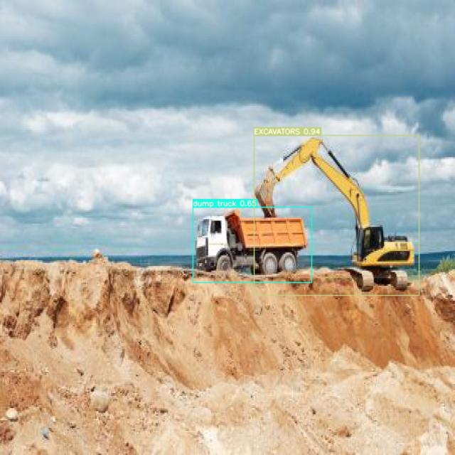

# Object detection based on YOLOv7<!-- omit in toc -->


- [Presentation](#presentation)
- [Notebook used to train the model](#notebook-used-to-train-the-model)
- [Functional view](#functional-view)
- [Component view and Dockerization](#component-view-and-dockerization)
- [Time dependencies in docker-compose](#time-dependencies-in-docker-compose)
- [Design choices](#design-choices)
  - [REST APIs](#rest-apis)
  - [Web applications](#web-applications)
  - [Persistency](#persistency)
  - [Authentication](#authentication)
  - [Authorization and role-based access control](#authorization-and-role-based-access-control)
  - [Logging](#logging)
    - [Usage logs](#usage-logs)
    - [Operational logs](#operational-logs)
    - [System logs](#system-logs)
  - [Monitoring](#monitoring)
  - [Dependency injection](#dependency-injection)
  - [Exception handling](#exception-handling)
  - [Automated tests](#automated-tests)
- [How to setup the docker containers](#how-to-setup-the-docker-containers)
- [How to use the application](#how-to-use-the-application)
- [A warning about performance](#a-warning-about-performance)

## Presentation

This repository contains all the artifacts (python code, configuration files, bash scripts, docker files...) needed to deploy our MLOps project developed during our [MLOps training](https://datascientest.com/formation-ml-ops) at [DataScientest](https://datascientest.com/).

The goal of this project is to explore all what it takes to bring a deep learning solution into production.  

Our project offers a **generic object-detection solution based on [YOLOv7](https://github.com/WongKinYiu/yolov7)**. 
YOLOv7 is currently considered as [the fastest object detection algorithm](https://viso.ai/deep-learning/yolov7-guide/).

This project was developed by the following team :
- [François Jean-Charles](http://linkedin.com/in/françois-jean-charles-799808248/)
- [Noël Henrot](http://linkedin.com/in/noelhenrot/)

The YOLOv7 deep learning model has been trained to recognize 3 categories of objects :
- Excavators
- Dump trucks
- Wheel loaders

The picture below illustrates the detection with a picture having 2 categories of objects :




The dataset to train the model was taken from a [public universe on Roboflow](https://universe.roboflow.com/mohamed-sabek-6zmr6/excavators-cwlh0/browse?queryText=&pageSize=50&startingIndex=0&browseQuery=true) and consists of :
- 2655 images for training
- 267 images for validation 
- 144 images for test

Credits and thanks to Mohamed Sabek !

The training phase results in a weight file characterizing the trained neural network.  This weight file is all what is needed to specifically detect the target objects categories.  Recognizing another type of objects simply requires to plug another weight file resulting from training on properly labeled pictures.


## Notebook used to train the model

The notebook [train.ipynb](notebooks/train.ipynb) is what we have used to train the system.  If we wanted to implement an automated "retrain" capabilty, we should extract the code from this notebook and store is as Python script that could be triggered by an administrator or by a cron job.  This is illustrated in the 2 following sections (functional view and component view).

Note : for performance reasons, the notebook was run on [PaperSpace Gradient](https://www.paperspace.com/gradient/notebooks) but it should probably run with minor changes on Google Colaboratory.


## Functional view

The figure below illustrates the use cases for the two categories of users of the system.  We represent here all the desired use cases of a complete entreprise-grade system. We have implemented the most important ones, which are highlighted in green.  The use case "UC06 - Update ML model" (and associated UC02 + UC07) would also be interesting, but it was difficult to implement this in the time frame of this project.  Use cases UC03, UC08, UC09 and UC10 are basic CRUD operations and are not really relevant for our MLOps project.


## Component view and Dockerization

The architecture of the system and associated docker components is illustrated below. 


As typical in an enterprise system, we have foreseen a front-office (FO) web application exposed to the Internet and a back-office (BO) application exposed to the intranet.   The FO web app only exposes UC01 to UC03, while the back-office application exposes **all** use cases.  Separating FO and BO web app in two deployement units allows to properly isolate those components in their own network (external vs internal). 

As far as the API layer is concerned, we could have used a single API deployment but for security and performance reasons we have chosen to deploy 2 separate instances of the API. The FO instance only exposes routes needed for UC01 to UC03 while the BO instance exposes all routes.  Again, having two separate deployment units provides proper network isolation and enhanced security.

It is important to note that the python code is **common** for the BO and FO instances of the web app.  The same is true for BO and FO instances of the API.  The web app menus and API routes are dynamically enabled/disabled based on environment variables injected via docker-compose.

Finally we have chosen to have two separates databases (and matching servers).  One for the identity management (i.e. users) and one for the logs.  The reasons for this choice are the following :
- Identites and logs have different life-cycles, persistence requirements, archiving requirements, access modes and volumetry.  Separating them allows to properly address those diverging requirements (via specific database server parametrization).
- Users could be stored in another type of storage.  Most enterprises have an identity management system that is not necessarily accessible as a relational database.  Separating identities and logs provides the required decoupling to integrate with an external IAM system if the need arises.

## Time dependencies in docker-compose

We have a technical time dependency between the components depicted in the previous section : API cannot start until database server is ready.  We could have the same problem between the web apps and their API but the API is not queried until a user performs an action, so the problem is less critical.

Docker-compose does not provide a native way to delay the start of a component until another component is ready.  
We have solved this problem with the **Wait Tool** as explained in the [following article](https://www.datanovia.com/en/lessons/docker-compose-wait-for-container-using-wait-tool/).

This is illustraded here below for the FO API that waits until both database servers are up and ready:

```YAML
  od_api_fo:
    restart: always
    image: obj_detect_api_image:latest
    environment:
      - od_api_instance=FO
      - WAIT_HOSTS=obj_detect_db_users:5432, obj_detect_db_logs:5432
      - WAIT_HOSTS_TIMEOUT=300
      - WAIT_SLEEP_INTERVAL=30
      - WAIT_HOST_CONNECT_TIMEOUT=30      
    container_name: obj_detect_api_fo
    command: sh -c "/wait && uvicorn app.main:app --host 0.0.0.0 --port 8000 --reload"
    ports:
      - "8010:8000"
    networks:
      - obj_detect_network
```

## Design choices

### REST APIs

We have chosen FastAPI to implement our REST APIs.  We prefer it over FLASK for its performances, functionalities, automatic Swagger support and quality of documentation.  We also use its built-in support for authentication and dependency injection.

### Web applications

The web applications have been developped using :

- FastAPI
- Jinja2 for templating
- Bootstrap5 as framework for responsive website
- Python-Markdown to convert markdown files of static content to HTML

Again, FastAPI has been preferred over Flask or Django but here it was more for uniformity in terms of skills required : we did not have enough time to learn two different web frameworks.  By separating REST API and Web app in distinct components (at source level and deployment level) we also address a disadvantage of FastApi that is commonly cited. 

### Persistency

We have to persist two types of data : user identities and logs.  Identities are perfectly structured and subject to CRUD operations : a relational database is therefore appropriate.  As far as the logs are concerned a file system could fit but we have chosen a relational database as well mostly for uniformity and for the ease it offers for logs querying.

We have chosen [PostgreSQL](https://www.postgresql.org/) as RDMS because it is performant, free, open source and has a great user community.  We use the docker image 11.6-alpine which is 152 MBytes.  Note that MySQL would have been an appropriate choice as well for the simple database interactions we have to deal with.  

To access the database from Python code we use [SQLAlchemy](https://www.sqlalchemy.org/).  It is one of the most common Object Relational Mapper (ORM) for Python.  We use it fully as an ORM with data mappers and sessions.

### Authentication

We have chosen to identify the users with their login (aka username) and we let them authenticate by providing their password.  For security reasons, only password hashes are stored in the user table. 

The API implements the security scheme [OAuth2 with Password and Bearer](https://fastapi.tiangolo.com/tutorial/security/simple-oauth2/) and exposes a */token* route that accepts the password request form and, in case of successful authentication, returns a JWT token to the API client.

The web applications have a login screen that calls this */token* route and store the JWT token in an **[HttpOnly cookie](https://www.cookiepro.com/knowledge/httponly-cookie/)**.  For all subsequent requests to the API, the client browser will automatically send the cookie to the API which systematically verifies that the JWT token is valid and then extracts the user identity.  The validity of the JWT token is set to 15 minutes (configurable via config.yaml).

### Authorization and role-based access control

In terms of authorization, whe have to consider 2 types of authenticated users: normal users and administrators.  The role of a user is indicated in the user table by the boolean column *is_admin*.  

The web application and REST API must know the role of a user (normal user vs administrator) in order to properly implement access control.  We have solved this by adding a **role claim** in the JWT token.  This claim can take two values : "user" or "administrator".  When the web app requests a token for the user, the API looks into the database and sets the role claim in the JWT token based on the value of the is_admin column for that user.

For ease of coding, we have implemented two methods (check_authenticated() and check_is_admin()) that can be  plugged via dependency injection into the API operations as shown below.

```python
@router.get("/operational_logs", response_model=list[OperationalLog])
async def get_operational_logs( request : Request, 
                                skip: int = 0, limit: int = 100, 
                                db: Session = Depends(get_log_session), 
                                user: User = Depends(check_is_admin)):

```

Those methods automatically injects the required logic to decrypt the JWT token and check that the user has the appropriate rights.  It raises an authorization exception if it is not the case.

### Logging

A critical quality of a software system is its observability.  We have to know how the system behaves in production and have all the information required to troubleshoot the system when a problem occurs.  As typical in an enterprise-grade sytem we have foreseen 3 types of logs as described in the following sections.

#### Usage logs

Usage logs are needed to register the usage of the system by the users.  For each REST operation in the API, an entry is created with the timestamp, the user ID and the operation (HTTP verb + route).


#### Operational logs

Operational logs are used by the system administrator to verify the health of the system.  It registers important events like API startup or any unhandled exceptions.


#### System logs

For usage logs and operation logs, we have concentrated our efforts on the API since it is the core of the system.  For other components, we rely on an handy docker extension [Logs Explorer](https://hub.docker.com/extensions/docker/logs-explorer-extension).  This extension agregates the system logs of all the containers in our sytem.


### Monitoring

Docker has a form of monitoring similar to a watchdog.  Each component can expose a probe endpoint that Docker can monitor so as to restart the component when the probe fails repeatedly.  Although we have the probe endpoint for the API, we did not have the time to experiment with this Docker feature.

### Dependency injection

FastApi has a very simple and powerful dependency injection capability.  We use it for authentication, authorization and ORM session usage.  Not only does it simplify the code but it also allows to easily plug alternate implementations when needed (e.g. for testing scenarios).

### Exception handling

On top of the normal exception handling inside each method, we have implemented a global exception handler that catches any unhandled exception. This handler writes the exception in the operational logs so that it can be used for troubleshooting.  Adding the stack trace into the log was not done but would be easy to implement.


### Automated tests

We have developed automated tests with Pytest for the web apps and for the API.  
Running pytest -v in the API folder or in the webapp folder automatically runs all tests.
Note that you should set the environement variable od_api_instance to the value BO before running the API tests otherwise the tests related to administrator use cases will fail.


## How to setup the docker containers

- Clone the GitHub repository.
- Make sure that Curl is installed on your system since it will be used to download the trained weights file which is too big to store on GitHub.
- Make sure Docker host and CLI are running (e.g. Docker desktop on Windows).
- Make sure that ports 8010, 8011, 8020 and 8021 are available on your host.
- Run the script setup.sh to build the images and create the Docker containers.

You should obtain 3 docker images as depicted below:


And 6 containers as illustrated below:


## How to use the application

You can test front-office and back-office web apps as a simple user or as an administrator.  In the front-office all authenticated users have access to all options.  In the back-office, the options *Usage logs*, *Operational logs* and *Reset Databases* are reserved to the administrator role.

In your Docker user interface, click on the *Open in browser* button to test one of the web components in your browser.


If you don't have a Docker user interface, use the following URLs with your host web browser.

| Container   |URL from host   |
|----------|---------------|
| Web app Front Office | http://localhost:8020/ | 
| Web app Back Office |  http://localhost:8021/|
| API Front Office  | http://localhost:8010/ |
| API Back Office | http://localhost:8011/ |

A screenshot of the back-office web app is shown below.


Click on the *Login* menu option to authenticate as one of the 3 predefined users listed below.


| Login   |Password      |  Role |
|----------|---------------|-------|
| admin |  admin | administrator |
| noel |    noel   |   user |
| francois | francois |    user |


In order to perform object detection on an image , click on the *Detection* menu option, select a picture on your host and click the *Submit* button.   Several test pictures are available in the folder sample_pictures of the GitHub repository.  Also make sure to read the following section about performances (inference time).


## A warning about performance

Currently, the inference engine is started for **each** image selected by the user.  This greatly impacts the processing speed !

Indeed, for each image selected by the user, the following happens : 
- start YOLO inference engine
- load weights (291 MBytes)
- initialize YOLO Neural Network

A better design should allow to "let the YOLOv7 engine running" or to embed the engine in the same process as the API, so as to get a single process always alive (with the advantage of no inter-process communication but the disadvantage of tighter coupling).  But, **more fundamentally**, this requires that YOLOv7 exposes 2 methods (or endpoints) : a first to startup the inference engine with the desired hyper-parameters and weights and a second to invoke the inference process for a given image (or list of images).  At first sight, this would require some rework in YOLOv7 code.
